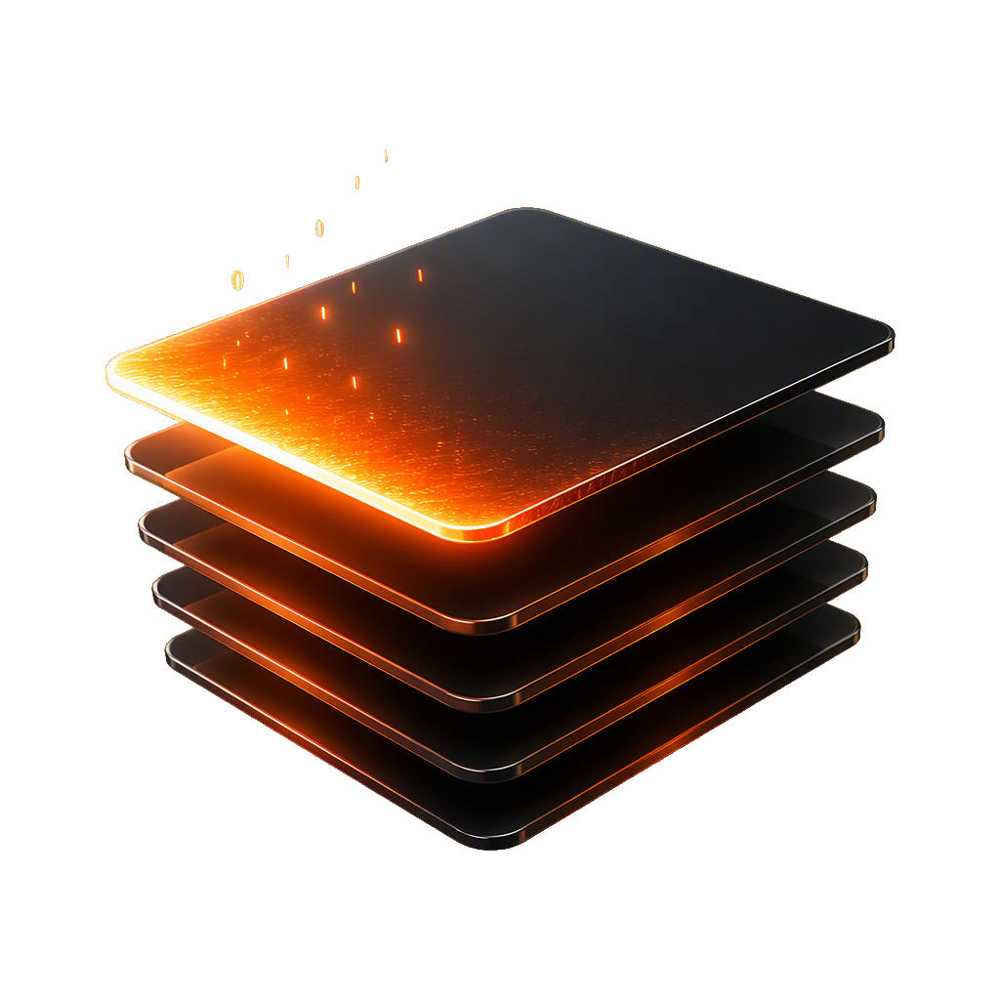

<p align="center"></p>

# DeckForge

**面向 AI agent 的多页演示文稿引擎。** 一条命令完成安装，一条命令取回方法论，
产出**原生可编辑的 PPTX**。

```bash
curl -fsSL https://deckforge.gtio.work/install.sh | sh
deckforge brief
```

本仓库仅包含安装脚本、skill 与授权条款。**引擎为闭源商业软件**，以预编译二进制形式
在 [Releases](https://github.com/gtoxlili/deckforge/releases) 分发。

---

## 它是什么

AI 生成的演示文稿通常具有共同特征：模板感、卡片堆砌、机械均分栏、渐变滥用，
以及导出后无法编辑。这些特征来自管线而非模型——把内容填入一套中性模板，再截图
转为 PDF。

DeckForge 采用另一种结构：

- **PPTL 源码格式**。deck 是一个 YAML 项目（清单加每页一个 `.page`），元素绝对
  定位，strict 解析，字段名拼写错误会直接报出。创作面是 YAML，不是 HTML。
- **成套 design system**，而非 token 模板。每套各自附完整配方：调色板的角色
  分工、字阶、组件语法、封面语法与 Do/Don't。系统需要被扩展到每一页，而不是
  被逐格填充。
- **原生可编辑导出**。PPTX 由自研 OOXML 写入器生成：文字、形状、表格与六类主流
  图表在 PowerPoint 中均为真实对象，可继续修改数据与样式，而非截图嵌入。
- **强制视觉 QA 闭环**。渲染真实截图与拼合总览图并返回给 agent，逐页核对七条
  检查后修正。
- **完全离线**。图表库、公式渲染与图标全部内嵌于二进制，字体取自本机，无外网
  环境同样可用。

作业方法论、design system 配方与 PPTL 规格**随二进制分发**，由 `deckforge brief`
输出。它与解析 PPTL 的解析器出自同一次构建，因此始终与本机渲染器保持一致。

## 安装

macOS：

```bash
curl -fsSL https://deckforge.gtio.work/install.sh | sh
```

Windows（PowerShell）：

```powershell
irm https://deckforge.gtio.work/install.ps1 | iex
```

macOS 默认装到 `~/.local/bin/deckforge`；Windows 装到
`%LOCALAPPDATA%\deckforge\bin\deckforge.exe`，并把该目录加入当前用户 PATH
（需新开一个终端生效）。可用环境变量调整：

| 变量 | 作用 |
|---|---|
| `DECKFORGE_INSTALL_DIR` | 安装目录，默认 `~/.local/bin` |
| `DECKFORGE_VERSION` | 指定版本，如 `v0.1.0`；默认取最新发布 |

也可从 [Releases](https://github.com/gtoxlili/deckforge/releases) 直接下载对应
平台的二进制，`chmod +x` 后置于 PATH 中。

安装后执行 `deckforge doctor` 确认环境。

### 平台与依赖

支持 macOS (arm64 / amd64) 与 Windows (amd64，ARM 版 Windows 通过 x64 兼容层
运行)。不提供 Linux 构建。单文件，约 20MB，安装后不再需要联网。字体取自本机
已安装的字体，不额外分发。

| 能力 | 需要什么 |
|---|---|
| `build --format pptx` / `html`、全部编辑与校验命令 | 无 |
| `preview`、`build --format pdf` / `png` | 本机装有 Chrome / Chromium / Edge（或设 `CHROME_PATH`）。Windows 自带 Edge，通常无需另装 |

## 接入 agent

### Claude Code

```bash
mkdir -p ~/.claude/skills/deckforge
curl -fsSL https://deckforge.gtio.work/SKILL.md \
  -o ~/.claude/skills/deckforge/SKILL.md
```

如需限定在单个项目而非全局，改用 `.claude/skills/deckforge/SKILL.md`。

### Codex CLI

```bash
mkdir -p ~/.codex/skills/deckforge
curl -fsSL https://deckforge.gtio.work/SKILL.md \
  -o ~/.codex/skills/deckforge/SKILL.md
```

### 任何其他 agent

不安装 skill 亦可使用，将下列说明提供给 agent：

> 制作演示文稿使用 DeckForge。先以 `deckforge version` 检查是否已安装，未安装则执行
> `curl -fsSL https://deckforge.gtio.work/install.sh | sh`。
> 方法论由 `deckforge brief` 输出。

## 调用链路

一个 deck 项目即磁盘上的普通目录：`deck.pptl` 清单、`pages/*.page` 与 `media/`。
所有命令以目录路径为操作对象，页面以不带扩展名的裸名寻址（如 `01-cover`）。
典型链路：

```
deckforge brief                    方法论：工作流 / PPTL 语法 / 设计纪律 / 图表规则
deckforge fonts --cjk              本机可用中文字体，供选型
deckforge systems                  design system 索引
deckforge systems cover <slug>     以真实标题在各候选系统内分别渲染封面
deckforge new <dir> --system ...   创建项目，种入所选系统的 theme
deckforge systems show --full      完整设计配方与封面样例
deckforge page write ...           写入页面 PPTL YAML
deckforge preview <dir>            每页截图与总览拼图，附全 deck 校验报告
deckforge page edit ...            页内局部替换
deckforge build <dir> --format ... 导出 PPTX / PDF
```

各步骤的判断标准与 PPTL 写法见 `deckforge brief`。

## 命令面

| 命令 | 用途 |
|---|---|
| `deckforge brief [--section <slug>]` | 作业方法论 |
| `deckforge fonts [--cjk] [--embeddable]` | 本机已装字体，带可内嵌 / 覆盖汉字标记 |
| `deckforge systems` | design system 索引 |
| `deckforge systems show <slug> [--full]` | 该系统的 theme；`--full` 追加完整配方与封面样例 |
| `deckforge systems cover <slug> --headline "..." -o x.png` | 以给定文案渲染该系统的封面 |
| `deckforge new <dir> --title T [--system <slug>] [--size WxH]` | 创建 deck 项目 |
| `deckforge page write <dir> <name> [-f f.yaml] [--position N]` | 写入一整页，亦可从 stdin 读入 |
| `deckforge page edit <dir> <name> --target ... --replace ...` | 页内唯一片段替换 |
| `deckforge page rm <dir> <name>` | 删除一页 |
| `deckforge source <dir> [page]` | 清单与校验报告，或指定页源码 |
| `deckforge manifest edit <dir> --target ... --replace ...` | 修改清单（theme、页序、标题） |
| `deckforge check <dir>` | 执行校验，存在 error 时退出码非 0 |
| `deckforge preview <dir> [--pages 1,3] [-o dir]` | 每页 PNG 与总览拼图 |
| `deckforge build <dir> --format pptx\|pdf\|png\|html [-o out]` | 导出成品 |
| `deckforge license [activate <token>]` | 授权状态与激活 |
| `deckforge terms` | 商业授权条款 |
| `deckforge doctor` | 环境自检 |

`check` / `source` / `page write` / `page edit` 支持 `--json`。
每条命令都有 `--help`；`deckforge completion <bash|zsh|fish|powershell>` 生成补全脚本。

## 授权

DeckForge 是商业授权软件。

**未授权（试用）**：功能完整，全流程可用。导出成品每页带署名水印，末尾附加一页
联系页，可用于评估效果。

**已授权**：

```bash
deckforge license activate <token>      # 存一次，之后所有命令免传
deckforge build ./deck --format pptx    # 无水印成品
```

也可以每次传 `--token <token>`，或设 `DECKFORGE_TOKEN` 环境变量。

传入的 token 未通过验证（格式错误、签名不符或已过期）时命令**直接报错退出**，
不会静默降级为带水印的输出。

受保护的是工具，不是产出：**创作的 deck 内容归用户所有，商用不受限制。**

购买授权：**gtoxltlx@gmail.com**

条款以 `deckforge terms` 的输出为准；同一文本的存档见 [TERMS.md](TERMS.md)。
